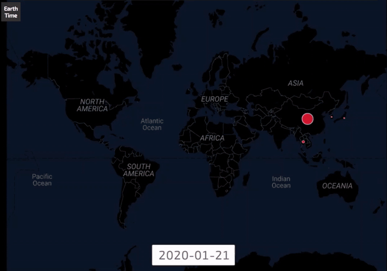
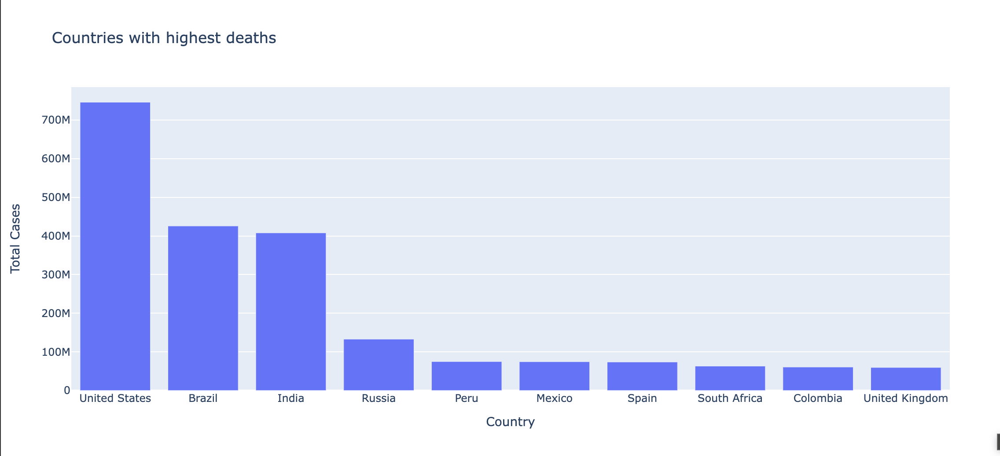
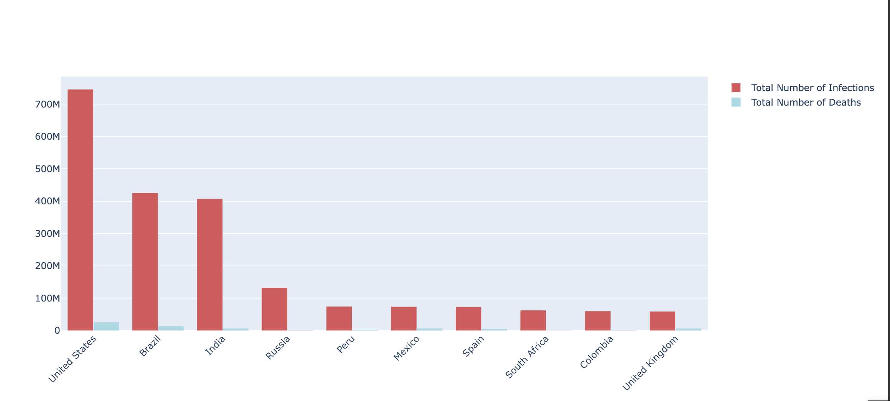
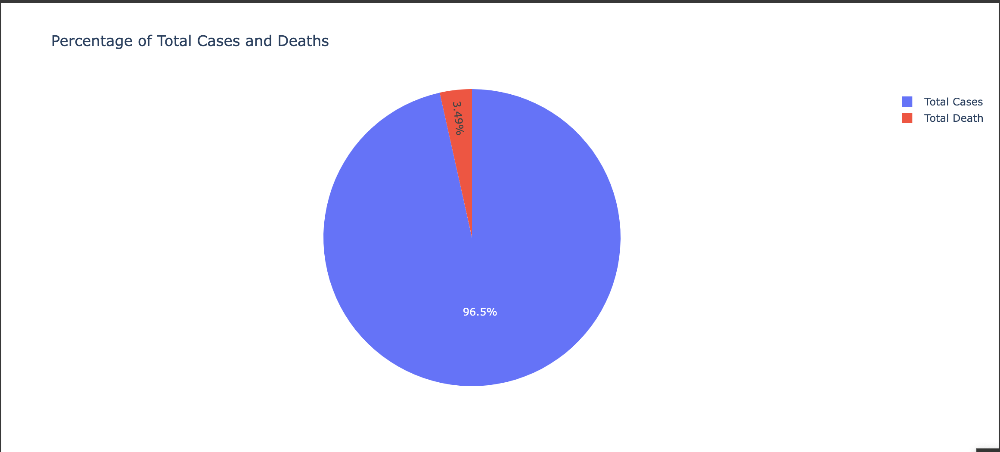
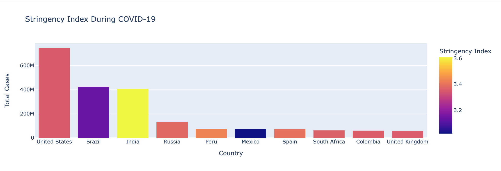
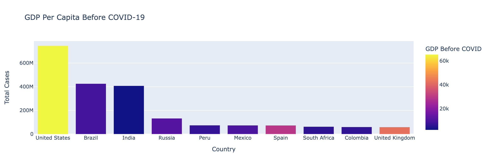
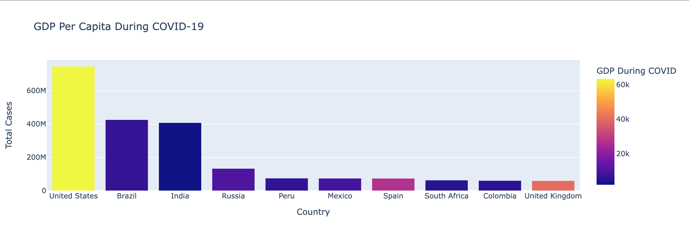
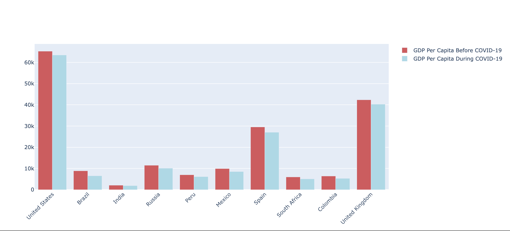
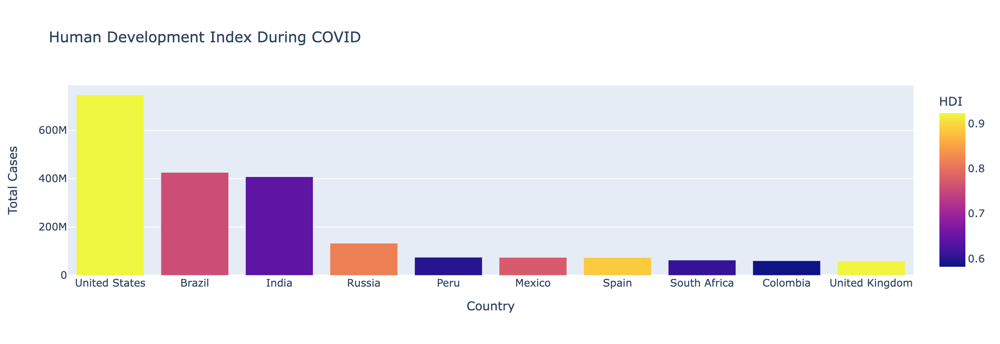

# Microeconomics-Project
It is the final project of AUT Microeconomics course.
> Instructor: [Dr. Fatemeh Salimi Namin](https://sites.google.com/view/fatemehsaliminamin?pli=1)

> Semester: Fall 2022

> Computer Engineering Department of Amirkabir University of Technology (Tehran Polytechnic)

## 👥Collaborators

- [Kiana Aghakasiri](https://github.com/kianak2002)

- [Mahan Ahmadvand](https://github.com/2000mahan)

## 😷Track the Spread of Coronavirus Around the World 

## 🗺Analysis

