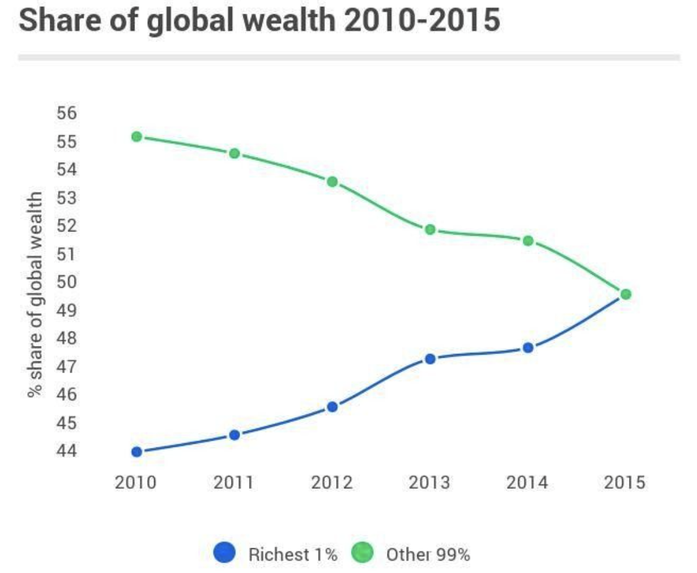
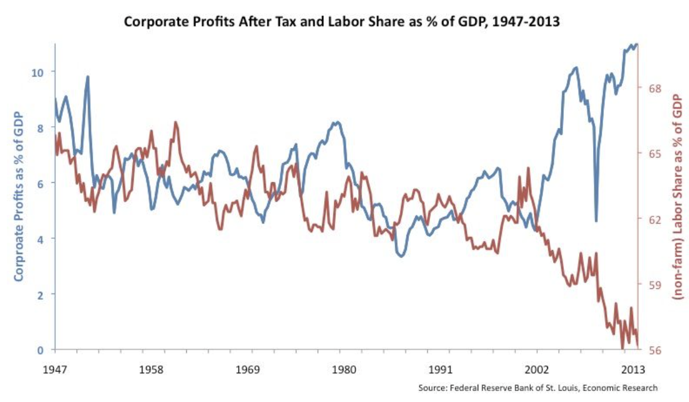

# Microeconomics-Project
It is the final project of AUT Microeconomics course.
> Instructor: [Dr. Fatemeh Salimi Namin](https://sites.google.com/view/fatemehsaliminamin?pli=1)

> Semester: Fall 2022

> Computer Engineering Department of Amirkabir University of Technology (Tehran Polytechnic)

## 👥Collaborators

- [Kiana Aghakasiri](https://github.com/kianak2002)

- [Mahan Ahmadvand](https://github.com/2000mahan)

## 😷Track the Spread of Coronavirus Around the World 

## 🗺Analysis

## Inequality and Globalization 

## Presentation Links

- [Aparat - Part1](https://www.aparat.com/v/qXk8H)
- [Aparat - Part2](https://www.aparat.com/v/TYdmz)
- [Aparat - Part3](https://www.aparat.com/v/thcQf)
- [Google Drive](https://drive.google.com/drive/folders/10FWXs_WYAQJAGX8sNJnKBR5DEZY_3ltK?usp=sharing)

## References
- https://www.unwomen.org/en/hq-complex-page/covid-19-rebuilding-for-resilience/employment-poverty?gclid=Cj0KCQiA45qdBhD-ARIsAOHbVdEqX0URHL2DK7FafcOaU3-vdt8fQstRL-fzMYvD_Ir4nywW4Cbpse0aAutnEALw_wcB
- https://mpra.ub.uni-muenchen.de/110399/1/MPRA_paper_110399.pdf
- https://ourworld.unu.edu/en/five-ways-coronavirus-is-deepening-global-inequality
- https://www.kaggle.com/code/rhiskey/covid-19-economy-impact-analysis
- https://ecoj.sbu.ac.ir/article_100967_1170173584d03a16e13e18ea2e8cddd9.pdf
- https://sgu.ac.id/top-5-companies-that-benefited-the-most-during-the-pandemic/
- https://www.cbpp.org/research/poverty-and-inequality/tracking-the-covid-19-economys-effects-on-food-housing-and
- https://ecoj.sbu.ac.ir/article_100967_1170173584d03a16e13e18ea2e8cddd9.pdf
- https://www.youtube.com/watch?v=yZOiv_m0iBI
- https://www.youtube.com/watch?v=nb0B88yMByk
